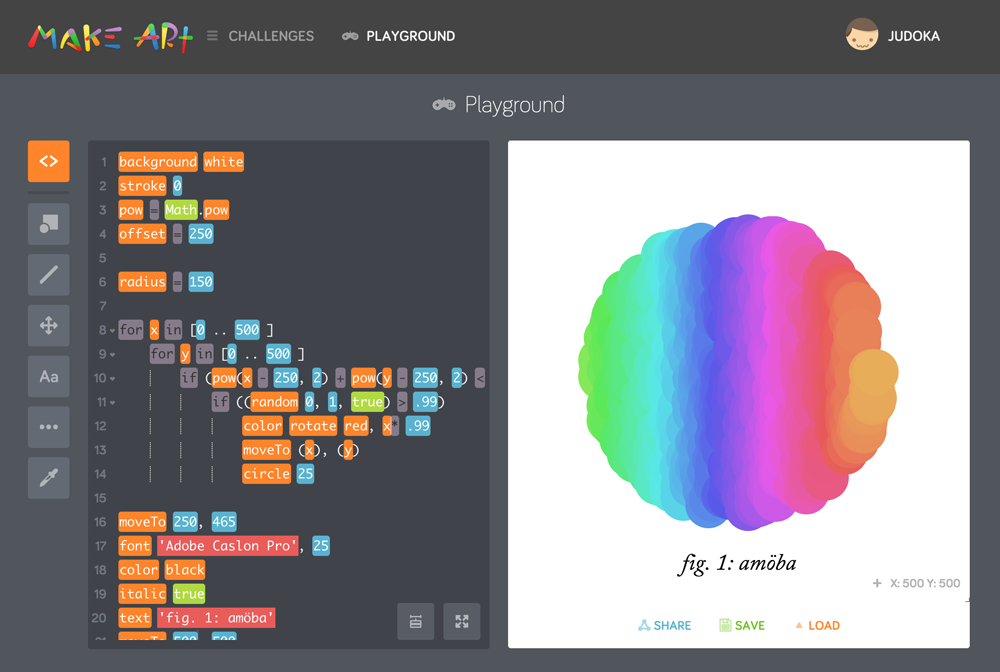

# Make Art

> An app for learning programming using a basic CoffeeScript drawing API

You can try the app [here »](http://art.kano.me/)

## Setup

    git clone git@github.com:KanoComputing/make-art.git
    cd make-art
    npm install

## Build

Build the app before running it 

    npm run build

## Run

    npm start

Open your browser at [http://localhost:3000](http://localhost:3000)

## Develop

Run the watch script when developing

    npm run watch
